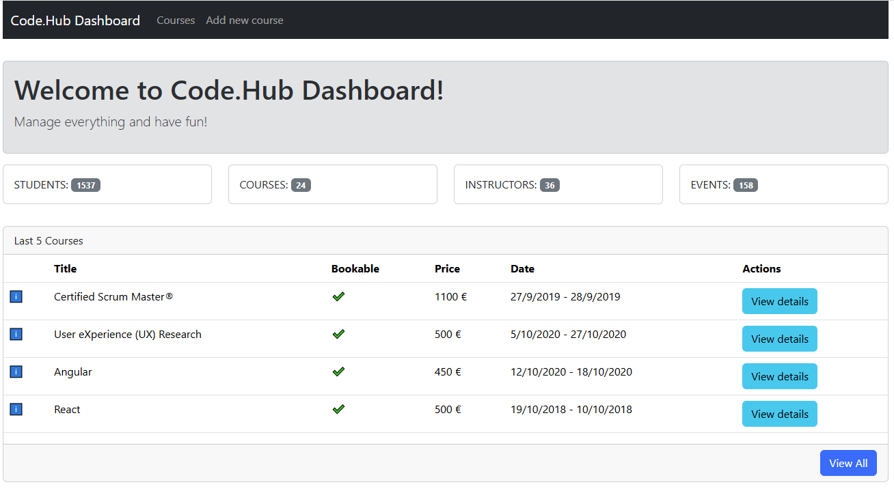
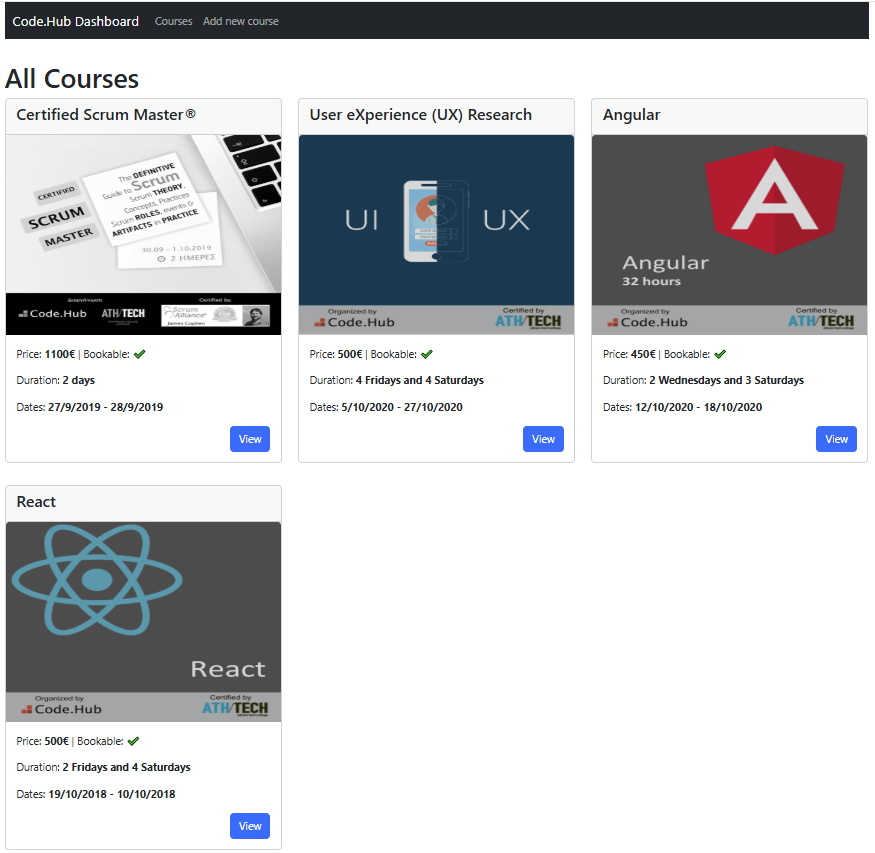
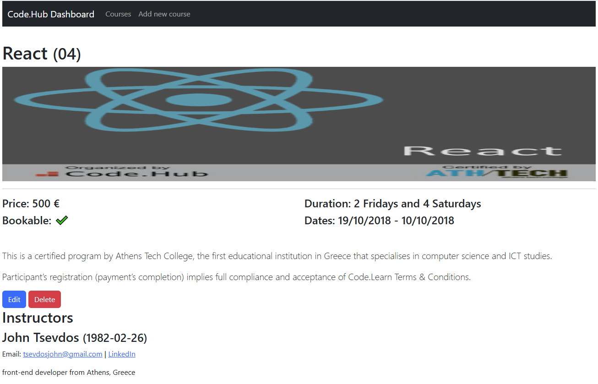
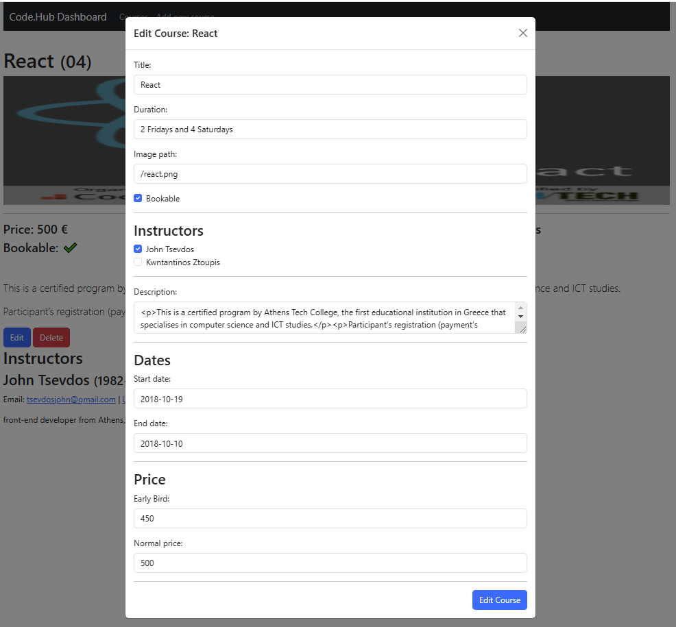
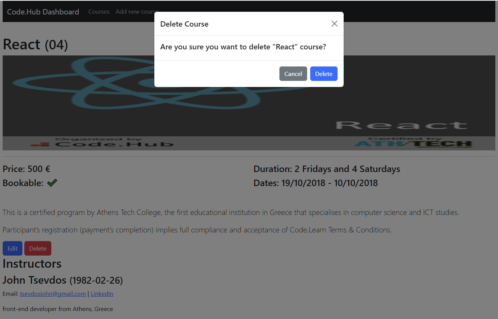
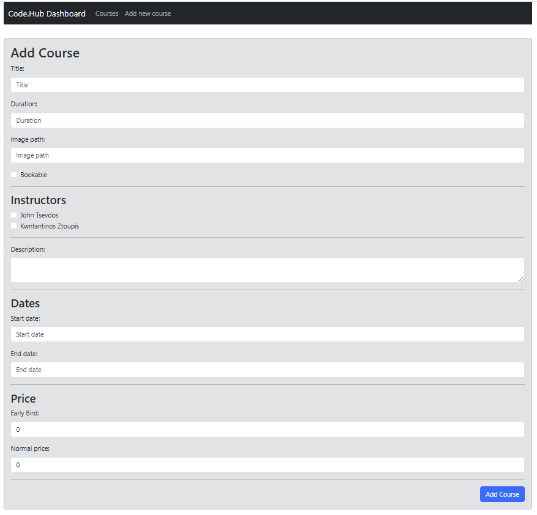

# Code.hub React Project

## App details

The application is using the below technologies:

- [Vite](https://vite.dev/) - for building and bundling
- [React](https://react.dev/) - for building the client-side app and components
- [React Router](https://reactrouter.com/) - for client-side (browser) routing
- [Reactstrap](https://reactstrap.github.io/) - for UI
- [axios](https://axios-http.com/docs/intro) - for HTTP requests

## Run locally

You need to have node.js installed. For development I used node version `20.2.0` and npm version `9.6.6`, but you can use any node/npm version you want from 18 and above. When you are ready, you can install all dependencies and run the development servers by typing the below commands:

```
npm install
npm run api
npm run dev
open http://localhost:5173
```

## Build app

Build the app:

```
npm run build
```

This command will create a `dist` directory with the generated `index.html` file and the assets folder including CSS and JS files.

## Lint files

Lint all js/jsx files:

```
npm run lint
```

Auto-fix linting issues:

```
npm run lint:fix
```

## User stories

### Dashboard page

The dashbord page must contain:

1. Code.Hub's stats (students, courses, instructors and events)
2. a list with the last 5 courses
3. every course must have a link that leads to the course details page
4. a link that leads to the courses page

#### Dashboard (sample)



### Courses page

The courses page must contain:

1. all the available courses
2. every course must have a link that leads to the course details page

#### Courses Page (sample)



### Course details page

The course details page must contain:

1. all the details of the course
2. all the course instructors
3. an edit button that will edit the current course (edit the course inline or in another page)
4. a delete button that will delete the current course

#### Courses Details Page (sample)



#### Edit Details (sample)



#### Delete Course (sample)



### Add new course page

The add new course page must contain:

1. a form with the appropriate course fields
2. a submit button that posts the data correctly

#### Add new course page (sample)


